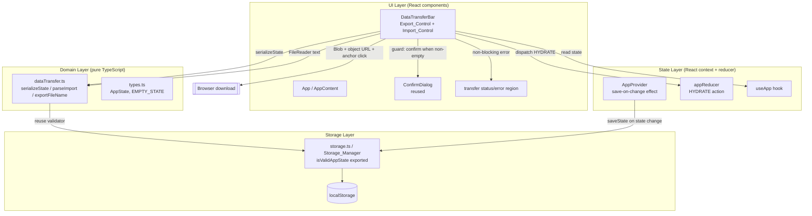

# Design Document

## Overview

Data Export & Import lets a single user back up their complete application state to a downloadable JSON file and restore it later, entirely client-side with no backend. It is a follow-on to the foundational Task & Habit Tracker (`.kiro/specs/task-habit-tracker/`) and deliberately reuses that spec's architecture, data model, and persistence layer rather than introducing anything parallel.

The central design goal is **no new schema and no new source of truth**. The exported document is exactly the existing `AppState` shape — `{ version, tasks, habits }`, with tags modeled as normalized names inline on tasks — that the `Storage_Manager` already persists and validates. Export is `JSON.stringify(state)`; import is `JSON.parse` followed by the *same* schema/version validator the `Storage_Manager` uses on restore. This guarantees that anything the app can save it can re-import, and that a file the app would reject on restore is rejected identically on import.

The second goal preserves the foundational separation of concerns: **serialization, parsing, and validation are pure functions**, while DOM and file APIs (Blob creation, download triggering, and `FileReader`) stay at the UI edge. This keeps the transferable logic exhaustively unit- and property-testable with Vitest, and lets the round-trip guarantee be verified with `fast-check`.

This design addresses all 6 requirements in `requirements.md`. Requirement numbers are referenced inline as **(Rn.m)** where a design element traces back to a specific acceptance criterion.

### Design Principles

- **Reuse the existing schema, do not fork it**: There is one `AppState` type and one schema validator. The import path calls the exact predicate the storage layer uses on restore, so export/import can never drift from persistence **(R4.1)**.
- **Pure transfer logic at the core**: A new `domain/dataTransfer.ts` module holds `serializeState`, `parseImport`, and `exportFileName` as pure functions over plain data. No `Blob`, no `FileReader`, no `Date.now()`, no React inside them — the "current day" is passed in **(R1.1, R1.3, R4.1–R4.4)**.
- **Side effects only at the edge**: The new UI control owns Blob/object-URL/anchor download and `<input type="file">`/`FileReader` reading. Applying an import reuses the state layer's existing `HYDRATE` action and the provider's existing save-on-change effect, so nothing new touches `localStorage` directly **(R1.2, R2.2)**.
- **Never destroy data on a bad file**: Parsing and validation complete *before* any state is replaced. Invalid or corrupt input is rejected with a non-blocking error and leaves in-memory and stored state untouched **(R2.3, R4.2, R4.3)**; a failed save after a valid import is rolled back to the pre-import state **(R2.4)**.
- **Accessibility by construction**: The export and import controls are native `<button>`/`<input>` elements with explicit labels, inheriting keyboard reachability, Enter/Space activation, and focus behavior from the platform **(R5, R6)**.

## Architecture

The feature adds one pure domain module and one UI component. It introduces **no new layer** and **no new persistence path** — it plugs into the existing three-layer architecture at two points: the pure domain core, and the App composition root.



### Layer responsibilities

- **Domain Layer** (`src/domain/dataTransfer.ts`): New pure functions for the transferable logic — serialize an `AppState` to a JSON string, parse and validate a candidate string back into an `AppState`, and compute the export filename. Depends only on `types.ts` and the schema predicate re-exported from the storage layer. Contains no DOM or file API **(R1.1, R1.3, R4.1–R4.4)**.
- **Storage Layer** (`src/storage/storage.ts`): Unchanged in behavior. Its private `isValidAppState` predicate is **promoted to a named export** so `dataTransfer.parseImport` validates against the identical schema/version check used on restore. `STORAGE_KEY` (`'task-habit-tracker/state'`) and the `saveState`/`loadState` API are untouched **(R4.1)**.
- **State Layer** (`src/state/`): Unchanged. The import flow reuses the existing `HYDRATE` action (`{ type: 'HYDRATE'; state: AppState }`) that replaces state wholesale, and relies on `AppProvider`'s existing save-on-change effect to persist the imported state. No new action, reducer branch, or effect is added **(R2.1, R2.2, R3.3)**.
- **UI Layer** (`src/components/DataTransferBar.tsx`, plus reused `ConfirmDialog`): A new container component owns all side effects — building the `Blob` and object URL and clicking a hidden anchor for export, and a hidden `<input type="file">` + `FileReader` for import — and orchestrates confirm-before-replace and non-blocking error display. It reads canonical state and dispatches via `useApp()` **(R1.2, R1.4, R2.x, R3.x)**.
- **Composition root** (`App` / `AppContent`): Mounts `DataTransferBar` into the existing layout (a toolbar near the header) without disturbing the current sections **(R1, R2, R5.1)**.

### Data flow for an import (example: restoring a backup into a non-empty workspace)

1. The user activates the `Import_Control` and selects a file through the hidden `<input type="file">` **(R2.1, R5.3)**.
2. `DataTransferBar` checks the file size; if it exceeds `MAX_IMPORT_BYTES` (10 MB) it rejects immediately with a non-blocking error and reads nothing **(R2.3)**.
3. A `FileReader` reads the file as text. A read failure is caught and surfaced as a non-blocking error, leaving state unchanged **(R2.3)**.
4. The text is passed to the pure `parseImport(text)`. It `JSON.parse`s (catching syntax errors) and runs the shared `isValidAppState` predicate. On failure it returns `{ ok: false, error }`; the component shows the non-blocking error and does nothing else **(R2.3, R4.2, R4.3)**.
5. On `{ ok: true, state }`, the component captures the *current* `state` as `previousState`, then checks whether the current state has any task or habit. If it does, it opens `ConfirmDialog`; if the workspace is empty it skips confirmation **(R3.1, R3.2)**.
6. On confirm (or when confirmation was skipped), the component dispatches `{ type: 'HYDRATE', state: imported }`, replacing in-memory state **(R2.1, R3.3)**.
7. `AppProvider`'s existing effect observes the state change and calls `saveState(imported)`, persisting the import through the `Storage_Manager` **(R2.2, R3.3)**.
8. If that save fails, the provider surfaces its storage warning; the import flow additionally restores `previousState` (re-dispatching `HYDRATE` with the captured value) and shows a non-blocking "could not be saved" error **(R2.4)**.
9. On cancel or dismiss of the dialog, no dispatch occurs and state is left unchanged in memory and storage **(R3.4)**.

### Data flow for an export (example)

1. The user activates the `Export_Control` **(R1.1, R5.3)**.
2. `DataTransferBar` calls `serializeState(state)` to produce the JSON string and `exportFileName(today)` for the filename **(R1.1, R1.3)**.
3. It creates a `Blob`, an object URL, and clicks a transient anchor to trigger the browser download, then revokes the URL **(R1.2)**.
4. If any of those browser calls throw, the failure is caught and shown as a non-blocking error; in-memory state is untouched **(R1.4)**.

## Components and Interfaces

### Domain module (pure) — `src/domain/dataTransfer.ts`

```ts
// Feature: data-export-import
import type { AppState, DateKey } from './types';
// Reuses the SAME schema/version validator the Storage_Manager applies on
// restore, promoted to a named export (no divergent schema) (R4.1).
import { isValidAppState } from '../storage/storage';

/** Fixed application-identifying filename prefix (R1.3). */
export const EXPORT_FILENAME_PREFIX = 'task-habit-tracker-backup';

/** Upper bound on import size, enforced at the UI edge (R2.1, R2.3). */
export const MAX_IMPORT_BYTES = 10 * 1024 * 1024; // 10 MB

/** Outcome of parsing + validating a candidate import string. */
export type ParseResult =
  | { ok: true; state: AppState }
  | { ok: false; error: string };

/**
 * Serialize the complete AppState to a JSON document. This is the round-trip
 * source of truth: it emits the exact AppState shape (version, tasks with inline
 * tags, habits) the Storage_Manager persists (R1.1, R4.4).
 */
export function serializeState(state: AppState): string;

/**
 * Parse and validate a candidate import string into an AppState.
 *
 * JSON.parses the text (catching syntax errors -> ok:false) then runs the SAME
 * isValidAppState predicate used by the Storage_Manager. Returns ok:false with a
 * user-facing message on invalid JSON, wrong version, or malformed task/habit;
 * ok:true with the validated state otherwise. Pure — no DOM, no file APIs
 * (R2.3, R4.1, R4.2, R4.3).
 */
export function parseImport(text: string): ParseResult;

/**
 * Build the export filename: fixed prefix + ISO 8601 calendar date + ".json",
 * e.g. "task-habit-tracker-backup-2024-06-03.json". `day` is passed in from the
 * edge (no ambient clock) (R1.3).
 */
export function exportFileName(day: DateKey): string;
```

`parseImport` deliberately does **not** enforce `MAX_IMPORT_BYTES`; the size guard is a property of the *file*, checked at the UI edge before reading, so the pure function stays a function of its string input only.

### Storage layer change — `src/storage/storage.ts`

The only change is visibility: the existing private validator becomes a named export so the import path reuses it verbatim. No behavior changes.

```ts
// Before: function isValidAppState(value: unknown): value is AppState { ... }
// After:
export function isValidAppState(value: unknown): value is AppState { /* unchanged */ }
```

`STORAGE_KEY`, `saveState`, and `loadState` are unchanged. `loadState` already calls `isValidAppState` internally, so promoting it guarantees restore-validation and import-validation are literally the same code path **(R4.1)**.

### State layer (reused, unchanged)

The import applies through the existing action; no new state-layer code is required.

```ts
// src/state/appReducer.ts (existing)
export type AppAction =
  | /* ...task/habit actions... */
  | { type: 'HYDRATE'; state: AppState }; // replaces state wholesale — reused by import

// src/state/AppContext.tsx (existing)
export interface AppContextValue {
  state: AppState;
  dispatch: (action: AppAction) => void;
  warning: string | null;      // provider's storage warning, set when saveState fails (R2.4)
  dismissWarning: () => void;
}
export function useApp(): AppContextValue;
```

Because `AppProvider` already persists on every committed state change, dispatching `HYDRATE` with the imported state both replaces memory **(R2.1)** and triggers the save **(R2.2)** with no new wiring.

### UI component — `src/components/DataTransferBar.tsx`

Owns every side effect and all import orchestration. Reads `state`/`dispatch` via `useApp()`.

```ts
// Feature: data-export-import
export function DataTransferBar(): JSX.Element;
```

Responsibilities and behavior:

- **Export** — On `Export_Control` activation: `serializeState(state)` → `Blob([json], { type: 'application/json' })` → `URL.createObjectURL` → click a transient `<a download={exportFileName(today)}>` → `URL.revokeObjectURL`. Wrapped in try/catch; failure sets a non-blocking error and leaves state untouched **(R1.1–R1.4)**.
- **Import** — The `Import_Control` is a `<label>`-associated, visually-styled trigger backed by a hidden `<input type="file" accept="application/json">`. On change: size check → `FileReader.readAsText` → `parseImport` → capture `previousState` → confirm-if-non-empty → dispatch `HYDRATE` → rely on provider save → rollback on save failure **(R2.1–R2.4, R3.1–R3.4, R4.x)**. The file input value is reset after each attempt so selecting the same file again re-triggers `change`.
- **Confirmation** — Reuses `ConfirmDialog` (presentation-only; `role="dialog"`, `aria-modal`, focuses cancel on open, Escape cancels). Shown only when `state.tasks.length > 0 || state.habits.length > 0` **(R3.1, R3.2, R3.4)**.
- **Status/error surfacing** — A local, non-blocking region near the controls, mirroring `WarningBanner`'s accessible pattern: successful actions announce via `role="status"` `aria-live="polite"`; failures render `role="alert"`. This is local to the transfer controls rather than reusing the single global context `warning` (which the provider owns for storage failures), keeping export/import feedback co-located with its controls while staying consistent with the established non-blocking pattern **(R1.4, R2.3, R2.4, R4.2)**.

### UI components summary

| Component | Responsibility | Requirements |
| --- | --- | --- |
| `DataTransferBar` | Export (Blob/URL/anchor), import (file input/FileReader), size guard, confirm orchestration, HYDRATE dispatch, rollback, non-blocking status/error | R1, R2, R3, R4.2/4.3, R5, R6 |
| `ConfirmDialog` (reused) | Confirm before replacing non-empty data | R3.1, R3.3, R3.4 |
| `AppContent` (extended) | Mounts `DataTransferBar` in a header toolbar without disrupting existing sections | R1, R2, R5.1 |

Both controls are native elements — a `<button>` for export and a labeled `<input type="file">` for import — so keyboard reachability, Enter/Space activation, and visible focus come from the platform **(R5)**. Each carries a distinct, non-empty accessible name **(R6)**.

## Data Models

This feature introduces **no new persisted model**. The `Export_File` is a serialized instance of the existing `AppState` from `src/domain/types.ts`, reproduced here for reference:

```ts
export interface AppState {
  version: 1;        // Schema_Version — validated on both restore and import (R4.1, R4.2)
  tasks: Task[];     // each Task carries its tags inline (TagName[])
  habits: Habit[];
}
export const EMPTY_STATE: AppState = { version: 1, tasks: [], habits: [] };
```

The only new types are transfer-local and non-persisted:

```ts
export type ParseResult =
  | { ok: true; state: AppState }
  | { ok: false; error: string };

export const EXPORT_FILENAME_PREFIX = 'task-habit-tracker-backup';
export const MAX_IMPORT_BYTES = 10 * 1024 * 1024; // 10 MB
```

### Model notes and invariants

- **Single schema, single validator** (R4.1): `parseImport` validates with the same `isValidAppState` that `loadState` uses. Tags are validated as inline string arrays on tasks exactly as the storage validator already checks them; there is no separate tag entity to serialize or validate.
- **Version pinning** (R4.2): `isValidAppState` requires `version === 1`. A document with any other version is rejected by import for the same reason it would be rejected on restore.
- **Export = exact AppState** (R1.1, R4.4): `serializeState` emits `JSON.stringify(state)` with no reshaping, so an exported file is byte-for-byte the same structure the app persists, and re-importing it reconstructs an equal `AppState` (version, all tasks incl. inline tags, all habits).
- **Filename shape** (R1.3): `exportFileName(day)` = `` `${EXPORT_FILENAME_PREFIX}-${day}.json` `` where `day` is a `DateKey` (`YYYY-MM-DD`), producing e.g. `task-habit-tracker-backup-2024-06-03.json`.

## Correctness Properties

*A property is a characteristic or behavior that should hold true across all valid executions of a system — essentially, a formal statement about what the system should do. Properties serve as the bridge between human-readable specifications and machine-verifiable correctness guarantees.*

These properties are universally quantified and are intended to be implemented with a property-based testing library (`fast-check`) driving Vitest, at least 100 iterations each. They target the pure functions in `domain/dataTransfer.ts` (and the shared validator in `storage/storage.ts`). The file-download side effect, `FileReader` reading, the 10 MB size guard, confirm-before-replace orchestration, persistence/rollback wiring, and all accessibility criteria (R1.2, R1.4, R2.2, R2.4, R3, R5, R6) are validated by example/component/integration tests (see Testing Strategy) rather than by properties.

### Property 1: Export/import round-trip preserves application state

*For any* valid `AppState` (arbitrary tasks with inline tags, arbitrary habits with completion histories), `parseImport(serializeState(state))` returns `{ ok: true, state }` whose `state` is deep-equal to the original in its `version`, its complete set of tasks (including each task's inline tags), and its complete set of habits.

**Validates: Requirements 4.4, 1.1, 2.1**

*Validated in: `domain/dataTransfer.ts` (`serializeState`, `parseImport`)*

### Property 2: Non-JSON input is rejected with no state

*For any* string that is not valid JSON, `parseImport` returns `{ ok: false }` with a non-empty error message and no `state` field, so no contents can be applied.

**Validates: Requirements 4.3, 2.3**

*Validated in: `domain/dataTransfer.ts` (`parseImport`)*

### Property 3: Schema- or version-invalid JSON is rejected

*For any* JSON value that is not a schema-valid `AppState` — including a wrong `version`, a missing `tasks`/`habits` array, or a malformed task or habit — `parseImport` returns `{ ok: false }` and never `ok: true`.

**Validates: Requirements 4.1, 4.2, 2.3**

*Validated in: `domain/dataTransfer.ts` (`parseImport`)*

### Property 4: Export filename has the fixed prefix, the date, and the .json extension

*For any* `DateKey`, `exportFileName(day)` returns a string that starts with `EXPORT_FILENAME_PREFIX`, contains the given `day`, and ends with the `.json` extension.

**Validates: Requirements 1.3**

*Validated in: `domain/dataTransfer.ts` (`exportFileName`)*

### Property 5: Import validation matches storage validation exactly

*For any* parsed JSON value, `parseImport(JSON.stringify(value))` returns `ok: true` if and only if `isValidAppState(value)` is `true`; the two accept exactly the same set of `AppState` values, confirming import reuses the storage schema with no divergence.

**Validates: Requirements 4.1**

*Validated in: `domain/dataTransfer.ts` (`parseImport`) + `storage/storage.ts` (`isValidAppState`)*

## Error Handling

All import/export errors are **non-blocking**: they never prevent the user from continuing to work with in-memory data, and they never destroy existing data. Errors fall into three groups.

### Export failures (rare, recoverable)

`serializeState` on a valid `AppState` does not throw. The browser-facing steps (`Blob`, `URL.createObjectURL`, anchor click) are wrapped in try/catch. On any failure the component leaves in-memory state unchanged and shows a non-blocking error indicating the export could not be completed **(R1.4)**.

### Import rejections (expected, guarded)

Rejections are detected *before* any state is replaced, so a bad file can never overwrite good data **(R4.1)**:

- **File too large** — the file's size is compared to `MAX_IMPORT_BYTES` before reading; oversize files are rejected with a non-blocking error and are never read **(R2.3)**.
- **Unreadable file** — a `FileReader` error is caught; state is left unchanged and a non-blocking error is shown **(R2.3)**.
- **Invalid JSON** — `parseImport` catches `JSON.parse` syntax errors and returns `{ ok: false }`; no contents are applied **(R4.3, R2.3)**.
- **Schema/version mismatch** — `parseImport` runs `isValidAppState`; a wrong version or malformed task/habit yields `{ ok: false }` and the import is rejected, leaving memory and storage untouched **(R4.2, R2.3)**.

Each rejection surfaces a non-blocking error in the transfer status region (`role="alert"`) and dispatches nothing.

### Replace confirmation

When a valid file is parsed and the current workspace contains at least one task or habit, `ConfirmDialog` guards the replacement; nothing is replaced until the user confirms **(R3.1)**. Confirm dispatches `HYDRATE` and persists **(R3.3)**; cancel or dismiss (including Escape) closes the dialog with no dispatch, leaving state unchanged in memory and storage **(R3.4)**. When the workspace is empty the import is applied directly without a dialog **(R3.2)**.

### Post-import save failure (rollback)

Applying an import dispatches `HYDRATE`; the provider's save-on-change effect then calls `saveState`. If that write fails:

- The provider sets its non-blocking storage `warning` (its existing behavior), leaving in-memory state as-is.
- The import flow, having captured `previousState` before dispatching, restores it by re-dispatching `HYDRATE` with the pre-import value and shows a non-blocking error indicating the import could not be saved **(R2.4)**.

This keeps the "a failed save never leaves the user with half-applied, unpersisted data" guarantee: after a save failure the workspace matches its pre-import state in both memory and storage.

## Accessibility

The export and import controls are built from native, semantic HTML so keyboard and screen-reader behavior come from the platform, consistent with `.kiro/steering/ui-ux-standards.md` (Tailwind CSS v4 on native elements, WCAG 2.1 AA, `min-h-11` touch targets, mobile-first).

### Keyboard operability (R5)

- **Reachability & order** — The `Export_Control` (`<button>`) and `Import_Control` (a labeled file input) are native, in the tab order by default, and placed in DOM order matching their visual reading order; no `tabindex="-1"` is used, so both are reachable with Tab/Shift+Tab **(R5.1)**.
- **Visible focus** — Each control carries a `focus-visible:ring-2` indicator that remains visible while focused and meets the AA non-text contrast requirement; the default outline is never removed without a replacement **(R5.2)**.
- **Activation** — Because the export control is a real `<button>` and the import trigger is a `<label>` bound to a native `<input type="file">`, Enter and Space activate them the same way a pointer click does, with no extra key handling **(R5.3)**.
- **No focus trap** — No control captures focus; Tab/Shift+Tab move focus away freely. The `ConfirmDialog` (shown only during a guarded replace) manages its own focus and closes on Escape, returning control to the user **(R5.4)**.

### Accessible labels (R6)

- **Export** — The export button's accessible name (from its text content, e.g. "Export data") conveys that it initiates an export **(R6.1)**.
- **Import** — The import trigger exposes a non-empty accessible name (e.g. "Import data") conveying that it selects a file and starts an import; the hidden `<input type="file">` is associated via `<label htmlFor>`/`id` so it is never an unlabeled input **(R6.2)**.
- **Distinct & stable** — The two accessible names differ so assistive technology can distinguish them **(R6.3)**, and each control's accessible name is fixed regardless of enabled/disabled/focused state — state changes are conveyed via `disabled`/focus styling, not by mutating the label text **(R6.4)**.

These are verified with Testing Library queries (`getByRole('button', { name })`, `getByLabelText`) so a missing or changed label fails the suite.

## Testing Strategy

Testing uses **Vitest** with four complementary layers, mirroring the foundational spec's approach and keeping the transfer logic pure and fully testable.

### Property-based tests (pure transfer logic)

- Library: **`fast-check`** integrated with Vitest. Property-based testing is **not** implemented from scratch.
- Each of the 5 correctness properties above is implemented by a **single** property-based test running **at least 100 iterations**.
- Each test is tagged with a comment referencing the design property, in the format:
  `// Feature: data-export-import, Property {number}: {property text}`
- Generators: an arbitrary valid `AppState` generator (tasks with random titles, due dates or `null`, 0–20 inline tag names, `open`/`done` status with matching `completedAt`, and habits with random `DateKey` completion sets), plus generators for arbitrary strings (for non-JSON rejection), arbitrary JSON values (for schema-invalid rejection incl. wrong `version` and malformed task/habit), and arbitrary `DateKey`s (for filename format). Edge cases are seeded deliberately: empty state, non-ASCII titles/tags, boundary tag counts, empty and large completion histories.

### Unit tests (specific examples, boundaries, error cases)

Focused example-based tests complement the properties, kept minimal since properties cover broad input ranges:

- Corrupt payloads leave state unchanged: hand-crafted non-JSON, `version: 2`, missing `habits`, a task missing `status` — each yields `parseImport` `{ ok: false }` with a message **(R2.3, R4.2, R4.3)**.
- `exportFileName` for specific dates produces the exact expected string **(R1.3)**.
- `EMPTY_STATE` round-trips to an equal empty state **(R4.4)**.

### Component / interaction tests (UI, orchestration, accessibility)

Using **@testing-library/react** with the jsdom environment:

- **Export** — clicking `Export_Control` calls `serializeState` and triggers a download with the correct filename, mocking `URL.createObjectURL`/`revokeObjectURL` and the anchor click **(R1.1, R1.2, R1.3)**; forcing `createObjectURL` to throw shows a non-blocking error and leaves state unchanged **(R1.4)**.
- **Import — confirm path** — with a non-empty workspace, selecting a valid file opens `ConfirmDialog`; confirming dispatches `HYDRATE` with the imported state **(R3.1, R3.3)**; cancelling/dismissing (incl. Escape) leaves state unchanged **(R3.4)**.
- **Import — empty workspace** — with no tasks/habits, selecting a valid file applies it with no dialog **(R3.2)**.
- **Import — invalid file** — selecting a non-JSON, schema-invalid, or oversize file shows a non-blocking error and dispatches nothing **(R2.3, R4.2, R4.3)**.
- **Accessibility** — export reachable via `getByRole('button', { name: /export/i })`, import via `getByLabelText`/accessible name **(R6)**; both in tab order, distinct names, labels unchanged across disabled/focus states **(R5.1, R6.3, R6.4)**; Enter/Space activate the same handler as click **(R5.3)**.

### Integration tests (state replacement + persistence)

With a mocked/real `localStorage` and the real `AppProvider`:

- A confirmed import dispatches `HYDRATE` and the provider persists the imported state via `saveState`, so a reload would restore it **(R2.2, R3.3)**.
- Forcing `saveState` to fail after a valid import surfaces the storage warning and rolls the workspace back to its captured pre-import state in both memory and storage, with a non-blocking error shown **(R2.4)**.

### Coverage note

Visual focus-contrast detail (R5.2) is validated by asserting the `focus-visible` ring utilities are present plus manual review; full WCAG 2.1 AA conformance requires manual testing with assistive technologies and expert accessibility review beyond automated tests.
