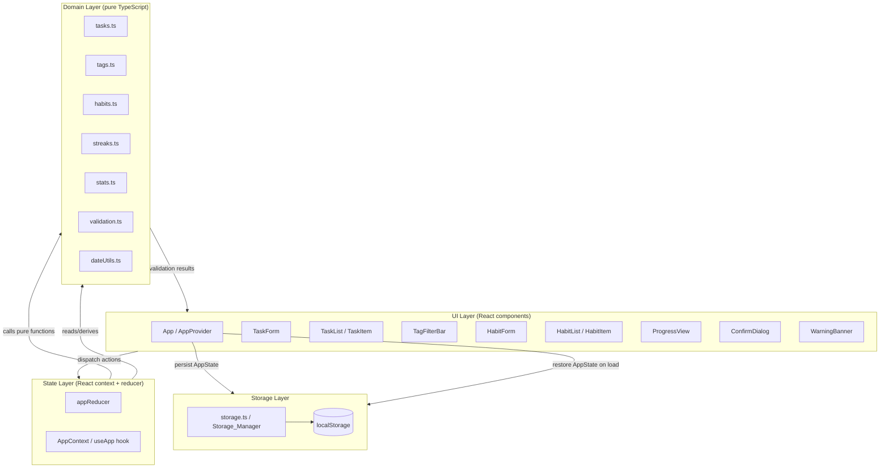

# Design Document

## Overview

The Task & Habit Tracker is a single-user, fully client-side web application built with React and TypeScript on Vite. It lets a person capture tasks, organize them with tags, filter tasks by tag, define and check off daily habits, view progress statistics, and persist everything to browser `localStorage` so nothing is lost on reload.

The central design goal is a **clean separation between pure domain logic and the React/browser shell**. All task, tag, habit, streak, and statistics logic lives in framework-free TypeScript modules that take plain data in and return plain data out. React components render that data and dispatch intents; the storage layer serializes the resulting state to `localStorage`. This keeps the domain logic exhaustively unit- and property-testable with Vitest, and it keeps the architecture modular enough that later specifications (reminders, notifications, data export, external integrations) can be layered on without reworking the core.

This design addresses all 15 requirements in `requirements.md`. Requirement numbers are referenced inline as **(Rn.m)** where a design element traces back to a specific acceptance criterion.

### Design Principles

- **Pure domain core**: Domain modules are pure functions over immutable data. No `Date.now()`, no `localStorage`, no React inside them — the "current day" and any clock are passed in as arguments. This makes streaks, completion rates, and week boundaries deterministic and testable.
- **Single source of truth**: One `AppState` object holds all tasks, tags, and habits. A reducer produces the next `AppState` from the current one plus an action.
- **Persistence as a side effect at the edge**: The reducer never touches storage. A thin effect layer persists `AppState` after each successful mutation and restores it on load, so persistence failures cannot corrupt in-memory state **(R12.2, R13.2)**.
- **Accessibility by construction**: Native semantic elements (`<button>`, `<input>`, `<label>`, `<form>`) are used throughout so keyboard operability and labeling come from the platform rather than custom handlers **(R14, R15)**.

## Architecture

The application is organized into three layers plus a thin composition root.



### Layer responsibilities

- **Domain Layer** (`src/domain/`): Framework-free pure functions. Owns all business rules — creating and editing tasks, tag association and filtering, habit completion toggling, streak calculation, progress statistics, validation, and date/week arithmetic. Depends on nothing but its own types.
- **State Layer** (`src/state/`): A `useReducer`-based store exposed through React context. `appReducer` maps `(AppState, AppAction) -> AppState` by delegating to domain functions. A `useApp()` hook exposes state plus typed dispatch helpers to components.
- **UI Layer** (`src/components/`): Presentational and container React components. They render derived data and dispatch actions. They hold only transient view state (form field values, dialog open/closed, filter selection) — never the canonical task/habit data.
- **Storage Layer** (`src/storage/`): The `Storage_Manager`. Serializes `AppState` to `localStorage` and restores it, handling write failures **(R12.2)** and parse/corruption failures **(R13.2)**. It is the only module that references `localStorage`.
- **Composition root** (`App` / `AppProvider`): Wires the layers together. On mount it loads persisted state via the storage layer and seeds the reducer; after each committed mutation it persists the new state and surfaces any warnings.

### Data flow for a mutation (example: completing a task)

1. User activates the complete control on a `TaskItem` (click, Enter, or Space) **(R14.3)**.
2. The component dispatches `{ type: 'COMPLETE_TASK', taskId, now }`, passing the current timestamp captured at the edge.
3. `appReducer` calls `completeTask(state, taskId, now)` in the domain layer, which returns a new `AppState` with the task's status set to `"done"` and a completion timestamp recorded **(R2.1, R2.2)**; if already done it returns state with the timestamp unchanged **(R2.4)**.
4. The provider effect observes the state change and calls `saveState(nextState)` **(R2.3, R12.1)**.
5. If the save throws, a non-blocking warning is set in view state; in-memory state is untouched **(R12.2)**.

## Components and Interfaces

### Domain modules (pure)

`src/domain/dateUtils.ts` — Date and week arithmetic in the user's local time zone.

```ts
/** Local calendar date key, e.g. "2024-06-03" (YYYY-MM-DD). */
export type DateKey = string;

export function toDateKey(d: Date): DateKey;              // local Y-M-D
export function addDays(key: DateKey, delta: number): DateKey;
export function isSameLocalDay(a: Date, b: Date): boolean;
/** Monday..Sunday week containing `key`, in local time. (R10.2, Calendar_Week) */
export function weekRange(key: DateKey): { start: DateKey; end: DateKey };
/** The DateKey list for the last `n` days ending on and including `key`. */
export function lastNDays(key: DateKey, n: number): DateKey[];
```

`src/domain/validation.ts` — Field validation shared by forms and reducer **(R1, R3, R5, R7)**.

```ts
export type ValidationError = { field: string; message: string };
export type Validated<T> = { ok: true; value: T } | { ok: false; errors: ValidationError[] };

export function validateTaskTitle(raw: string): Validated<string>;   // trim -> 1..200 (R1.3, R1.4, R3.3)
export function validateDueDate(raw: string | null): Validated<string | null>; // valid date or null (R1.5)
export function validateTagName(raw: string): Validated<string>;     // trim -> 1..50 (R5.3)
export function validateTagsForTask(existing: string[], toAdd: string): Validated<string[]>; // dup + <=20 (R5.1,R5.4,R5.5,R1.6)
export function validateHabitName(raw: string): Validated<string>;   // trim -> 1..100 (R7.2, R7.3)
export function validateTargetFrequency(raw: string | null): Validated<TargetFrequency>; // (R7.4)
```

`src/domain/tasks.ts` — Task lifecycle.

```ts
export function createTask(state: AppState, input: NewTaskInput): AppState;      // (R1.1, R1.2)
export function editTask(state: AppState, taskId: string, patch: TaskPatch): AppState; // (R3.1, R3.2)
export function completeTask(state: AppState, taskId: string, now: number): AppState;  // (R2.1,R2.2,R2.4)
export function deleteTask(state: AppState, taskId: string): AppState;           // (R4.2, R4.3)
```

`src/domain/tags.ts` — Tag association and filtering.

```ts
export function addTagToTask(state: AppState, taskId: string, tagName: string): AppState; // (R5.1,R5.3,R5.4,R5.5)
export function availableTags(state: AppState): string[];                         // distinct tag names (R5.2)
/** Tasks associated with ALL selected tags; empty selection => all tasks. (R6.1,R6.2,R6.3) */
export function filterTasksByTags(tasks: Task[], selectedTags: string[]): Task[];
```

`src/domain/habits.ts` — Habit lifecycle and completion toggling.

```ts
export function createHabit(state: AppState, input: NewHabitInput): AppState;     // (R7.1)
export function checkOffHabit(state: AppState, habitId: string, day: DateKey): AppState;   // idempotent (R8.1, R8.2)
export function uncheckHabit(state: AppState, habitId: string, day: DateKey): AppState;    // no-op if absent (R8.3, R8.4)
export function isCompletedOn(habit: Habit, day: DateKey): boolean;
```

`src/domain/streaks.ts` — Streak calculation.

```ts
/** Consecutive days with a Completion_Record ending on and including `today`; 0 if today missing. (R9.1,R9.2) */
export function currentStreak(habit: Habit, today: DateKey): number;
```

`src/domain/stats.ts` — Progress statistics.

```ts
export function tasksCompletedOn(tasks: Task[], day: DateKey): number;            // (R10.1, R10.3)
export function tasksCompletedInWeekOf(tasks: Task[], day: DateKey): number;      // Mon-start week (R10.2, R10.3)
/** Whole-number percent 0..100 of days completed over last 7 days ending on `today`. (R11.2) */
export function completionRate(habit: Habit, today: DateKey): number;
```

### State layer

```ts
export type AppAction =
  | { type: 'CREATE_TASK'; input: NewTaskInput }
  | { type: 'EDIT_TASK'; taskId: string; patch: TaskPatch }
  | { type: 'COMPLETE_TASK'; taskId: string; now: number }
  | { type: 'DELETE_TASK'; taskId: string }
  | { type: 'ADD_TAG'; taskId: string; tagName: string }
  | { type: 'CREATE_HABIT'; input: NewHabitInput }
  | { type: 'CHECK_HABIT'; habitId: string; day: DateKey }
  | { type: 'UNCHECK_HABIT'; habitId: string; day: DateKey }
  | { type: 'HYDRATE'; state: AppState };

export function appReducer(state: AppState, action: AppAction): AppState;

export interface AppContextValue {
  state: AppState;
  dispatch: (action: AppAction) => void;
  warning: string | null;          // non-blocking storage warning (R12.2, R13.2)
  dismissWarning: () => void;
}
export function useApp(): AppContextValue;
```

The reducer is pure and never throws for user-input problems; invalid mutations return the input state unchanged (the UI has already surfaced the validation error via `validation.ts`). Actions carry `now`/`day` from the edge so the reducer stays deterministic.

### Storage layer

```ts
export interface LoadResult {
  state: AppState;
  warning: string | null;   // set when restore failed and empty state was substituted (R13.2)
}
export interface SaveResult {
  ok: boolean;
  warning: string | null;   // set when the write failed (R12.2)
}

export function loadState(): LoadResult;          // (R13.1, R13.2)
export function saveState(state: AppState): SaveResult;  // (R12.1, R12.2)
```

### UI components

| Component | Responsibility | Requirements |
| --- | --- | --- |
| `AppProvider` | Loads persisted state on mount, hosts reducer, persists on change, exposes warnings | R12, R13 |
| `TaskForm` | Create/edit task; inline validation errors adjacent to fields | R1, R3 |
| `TaskList` / `TaskItem` | Render tasks, complete control, edit entry, delete trigger | R2, R3, R4 |
| `TagFilterBar` | Multi-select tag filters; empty-match indication | R5.2, R6 |
| `HabitForm` | Create habit; inline validation | R7 |
| `HabitList` / `HabitItem` | Render habits, check/uncheck toggle, streak display | R8, R9 |
| `ProgressView` | Daily/weekly task counts; per-habit streak & completion rate; empty states | R10, R11 |
| `ConfirmDialog` | Confirmation before destructive delete | R4.1, R4.4 |
| `WarningBanner` | Non-blocking, dismissible storage warning | R12.2, R13.2 |

All interactive controls are native elements (`<button>`, `<input>`, `<label>`, `<form>`) to inherit keyboard reachability, Enter/Space activation, and focus behavior **(R14)**. Every input is associated with a `<label>` (via `htmlFor`/`id`) and every icon-only button carries an `aria-label` **(R15)**.

## Data Models

All persisted data is plain, JSON-serializable TypeScript. Identifiers are string UUIDs. Timestamps are epoch milliseconds; calendar dates are stored as `DateKey` strings (`YYYY-MM-DD`) in local time.

```ts
export type TaskStatus = 'open' | 'done';
export type TargetFrequency = 'daily';
export type DateKey = string; // "YYYY-MM-DD" local

/** Tag name, trimmed, 1..50 chars. Stored inline on tasks as normalized names. */
export type TagName = string;

export interface Task {
  id: string;
  title: string;               // trimmed, 1..200 chars (Task_Title)
  dueDate: DateKey | null;     // valid local date or none
  tags: TagName[];             // 0..20 distinct trimmed names (<=20 per task)
  status: TaskStatus;          // "open" | "done"
  completedAt: number | null;  // epoch ms; set when status becomes "done"
  createdAt: number;
}

export interface Habit {
  id: string;
  name: string;                // trimmed, 1..100 chars (Habit_Name)
  targetFrequency: TargetFrequency; // "daily"
  completions: DateKey[];      // set of dates; at most one entry per calendar date
  createdAt: number;
}

/** The complete persisted application state — the single source of truth. */
export interface AppState {
  version: 1;                  // schema version for future migrations
  tasks: Task[];
  habits: Habit[];
  // Tags are modeled as normalized names inline on tasks; the distinct set is
  // derived via availableTags(). No separate tag entity is persisted, which keeps
  // tag data consistent by construction (a tag exists iff a task references it).
}

export const EMPTY_STATE: AppState = { version: 1, tasks: [], habits: [] };

export interface NewTaskInput { title: string; dueDate: string | null; tags: string[]; }
export interface TaskPatch { title?: string; dueDate?: DateKey | null; tags?: TagName[]; }
export interface NewHabitInput { name: string; targetFrequency: TargetFrequency; }
```

### Model notes and invariants

- **Tag modeling** (Glossary Tag, R5): Tags are normalized names stored inline on each `Task`. A tag "exists" as a filter option exactly when at least one task references it, satisfying **(R5.2)** without a separate entity to keep in sync. Per-task tags are kept distinct and capped at 20 by `validateTagsForTask` **(R5.4, R5.5, R1.6)**.
- **Completion uniqueness** (Glossary Completion_Record, R8): `Habit.completions` is treated as a set of `DateKey`s — at most one entry per calendar date. `checkOffHabit` adds the day only if absent (idempotent) **(R8.1, R8.2)**; `uncheckHabit` removes it if present, otherwise no-op **(R8.3, R8.4)**.
- **Completion timestamp** (R2): `completedAt` is set once when a task transitions to `"done"` and is left unchanged on repeated completion **(R2.4)**.
- **Schema version**: `version: 1` lets the storage layer detect and reject/upgrade incompatible data during restore **(R13.2)**.

## Correctness Properties

*A property is a characteristic or behavior that should hold true across all valid executions of a system — essentially, a formal statement about what the system should do. Properties serve as the bridge between human-readable specifications and machine-verifiable correctness guarantees.*

These properties are universally quantified and are intended to be implemented with a property-based testing library (`fast-check`) driving Vitest, at least 100 iterations each. Each property targets pure domain functions. UI, persistence side effects, and accessibility criteria are validated by example/component/integration tests (see Testing Strategy) rather than by properties.

### Property 1: Task creation grows the list and preserves inputs

*For any* `AppState` and any valid `NewTaskInput` (title trimming to 1–200 chars, valid or absent due date, ≤20 distinct valid tags), `createTask` returns a state whose task list is exactly one longer, and the new task has the trimmed title, the given due date, the given tags, `status === "open"`, and `completedAt === null`.

**Validates: Requirements 1.1, 1.2**

*Validated in: `domain/tasks.ts` (`createTask`)*

### Property 2: Title validity governs task creation and edits

*For any* string whose trimmed length is 0 (empty/whitespace-only) or greater than 200, `validateTaskTitle` returns `ok: false`, and `createTask`/`editTask` invoked with that title return the input state unchanged; *for any* string whose trimmed length is 1–200, `validateTaskTitle` returns `ok: true` with the trimmed value.

**Validates: Requirements 1.3, 1.4, 3.1, 3.3**

*Validated in: `domain/validation.ts` (`validateTaskTitle`), `domain/tasks.ts`*

### Property 3: Due-date validation accepts exactly parseable dates

*For any* string that does not parse to a valid calendar date, `validateDueDate` returns `ok: false`; *for any* string that parses to a valid date (and for `null`), it returns `ok: true`.

**Validates: Requirements 1.5**

*Validated in: `domain/validation.ts` (`validateDueDate`)*

### Property 4: Tag-add semantics (valid, distinct, capped)

*For any* task and any candidate tag name, `addTagToTask` associates the trimmed name if and only if the name is valid (trimmed length 1–50), the task has fewer than 20 tags, and the tag is not already present; in every rejected case the task's tag list is unchanged, and in every accepted case the resulting tag list contains the tag once and remains distinct with length ≤ 20.

**Validates: Requirements 1.6, 5.1, 5.3, 5.4, 5.5**

*Validated in: `domain/tags.ts` (`addTagToTask`), `domain/validation.ts` (`validateTagsForTask`)*

### Property 5: Available tags are exactly the distinct tags in use

*For any* `AppState`, `availableTags(state)` returns a list containing each distinct tag name that appears on at least one task, with no duplicates and no names that appear on no task.

**Validates: Requirements 5.2**

*Validated in: `domain/tags.ts` (`availableTags`)*

### Property 6: Tag filtering returns exactly the tasks matching all selected tags

*For any* list of tasks and any set of selected tags, `filterTasksByTags` returns exactly those tasks whose tag set contains every selected tag (superset relation); when the selection is empty, it returns all tasks.

**Validates: Requirements 6.1, 6.2, 6.3**

*Validated in: `domain/tags.ts` (`filterTasksByTags`)*

### Property 7: Completing a task is idempotent and stamps once

*For any* open task, `completeTask(state, id, now)` sets its status to `"done"` and `completedAt` to `now`; applying `completeTask` again with any later `now2` leaves the status `"done"` and `completedAt` at the original `now` (idempotent on the already-done task).

**Validates: Requirements 2.1, 2.2, 2.4**

*Validated in: `domain/tasks.ts` (`completeTask`)*

### Property 8: Deleting a task removes only that task

*For any* `AppState` and any task id present in it, `deleteTask` returns a state whose task list omits exactly that task and contains all other tasks unchanged, with length reduced by one.

**Validates: Requirements 4.2**

*Validated in: `domain/tasks.ts` (`deleteTask`)*

### Property 9: Habit creation adds a habit with empty history

*For any* valid `NewHabitInput` (name trimming to 1–100 chars, a `TargetFrequency`), `createHabit` appends a habit with the trimmed name, the given frequency, and an empty `completions` list.

**Validates: Requirements 7.1**

*Validated in: `domain/habits.ts` (`createHabit`)*

### Property 10: Check-off is idempotent (exactly one record per day)

*For any* habit and any `DateKey`, applying `checkOffHabit` once and applying it twice produce equal completion histories, and after either the habit has exactly one completion entry for that date.

**Validates: Requirements 8.1, 8.2**

*Validated in: `domain/habits.ts` (`checkOffHabit`)*

### Property 11: Check-off then uncheck is the identity on completion history

*For any* habit and any `DateKey` not already completed, `uncheckHabit(checkOffHabit(habit, day), day)` yields a completion history equal (as a set of dates) to the original; and `uncheckHabit` on a day with no record leaves the history unchanged.

**Validates: Requirements 8.3, 8.4**

*Validated in: `domain/habits.ts` (`checkOffHabit`, `uncheckHabit`)*

### Property 12: Current streak equals the consecutive run ending today

*For any* habit completion history and any `today`, `currentStreak(habit, today)` equals the length of the maximal run of consecutive calendar days ending on and including `today` that all have a completion record, and equals 0 whenever `today` has no completion record.

**Validates: Requirements 9.1, 9.2**

*Validated in: `domain/streaks.ts` (`currentStreak`)*

### Property 13: Daily task count matches tasks completed on that day

*For any* list of tasks and any `day`, `tasksCompletedOn(tasks, day)` equals the number of tasks whose `completedAt` falls on `day` in local time (and is 0 when none do).

**Validates: Requirements 10.1, 10.3**

*Validated in: `domain/stats.ts` (`tasksCompletedOn`)*

### Property 14: Weekly task count matches the Monday-start week of today

*For any* list of tasks and any `day`, `tasksCompletedInWeekOf(tasks, day)` equals the number of tasks whose `completedAt` falls within the Monday-to-Sunday local calendar week containing `day` (and is 0 when none do).

**Validates: Requirements 10.2, 10.3**

*Validated in: `domain/stats.ts` (`tasksCompletedInWeekOf`), `domain/dateUtils.ts` (`weekRange`)*

### Property 15: Completion rate is a whole percent within 0–100

*For any* habit and any `today`, `completionRate(habit, today)` is an integer in the inclusive range 0–100 equal to `round(daysCompletedInLast7 / 7 * 100)`, where `daysCompletedInLast7` counts the completed days among the 7 calendar days ending on and including `today`.

**Validates: Requirements 11.2**

*Validated in: `domain/stats.ts` (`completionRate`)*

### Property 16: Save/load roundtrip preserves application state

*For any* valid `AppState`, `loadState()` after `saveState(state)` returns a `state` deep-equal to the original (round-trip identity through serialization to `localStorage`).

**Validates: Requirements 13.1**

*Validated in: `storage/storage.ts` (`saveState`, `loadState`)*

### Property 17: Corrupt stored data yields empty state with a warning

*For any* stored string that is not valid JSON or does not parse into a schema-valid `AppState`, `loadState()` returns `EMPTY_STATE` together with a non-null warning.

**Validates: Requirements 13.2**

*Validated in: `storage/storage.ts` (`loadState`)*

## Error Handling

Errors fall into two categories, handled at different layers.

### User-input validation errors (recoverable, expected)

Validation lives in `domain/validation.ts` and returns `Validated<T>` — never throws. Forms call the validators on submit and, on failure, keep the entered values and render the error message adjacent to the offending field:

- **Task title** empty/whitespace or > 200 chars → error by the title field, values retained **(R1.3, R1.4, R3.3)**.
- **Due date** unparseable → error by the due-date field **(R1.5)**.
- **Tags** > 20 or any name empty/> 50 chars → error describing the invalid tag(s); existing tags untouched **(R1.6, R5.3, R5.4, R5.5)**.
- **Habit name** empty/whitespace or > 100 chars → error by the name field **(R7.2, R7.3)**.
- **Target frequency** missing → error by the frequency field **(R7.4)**.

The reducer treats an invalid mutation defensively: if a mutation function detects invalid input (a class the UI should have blocked), it returns the input state unchanged so state can never become invalid.

### Destructive-action confirmation

Deleting a task opens `ConfirmDialog` and removes nothing until the user confirms **(R4.1)**. Confirm dispatches `DELETE_TASK` and persists **(R4.2, R4.3)**; cancel closes the dialog with no dispatch, leaving the task in the list and storage **(R4.4)**.

### Storage failures (recoverable, non-blocking)

- **Write failure** — `saveState` wraps `localStorage.setItem` in try/catch. On failure it returns `{ ok: false, warning }`; in-memory `AppState` is untouched and a dismissible `WarningBanner` tells the user data could not be saved **(R12.2)**.
- **Restore failure** — `loadState` wraps `getItem` + `JSON.parse` + schema validation in try/catch. On any failure it returns `{ state: EMPTY_STATE, warning }`, and the app starts empty with a dismissible warning **(R13.2)**.

Warnings are non-blocking: they never prevent the user from continuing to work with in-memory data.

## Accessibility

Accessibility is achieved by using native, semantic HTML and letting the platform provide behavior, rather than reimplementing it.

### Keyboard operability (R14)

- **Reachability** — All controls are native `<button>`, `<input>`, `<select>`, and `<a>` elements, which are in the tab order by default. No interactive element uses `tabindex="-1"`, so every control is reachable with Tab/Shift+Tab **(R14.1)**.
- **Visible focus** — A global `:focus-visible` style provides a clearly visible outline on the focused control; the browser default outline is never removed without a replacement **(R14.2)**.
- **Activation** — Because controls are native `<button>`/`<input>`, Enter and (for buttons/checkboxes) Space trigger the same handler as a pointer click with no extra key handling. Habit check-off uses a real `<input type="checkbox">`; task complete/delete use `<button>` **(R14.3)**.
- Forms submit on Enter via native `<form onSubmit>`, and the `ConfirmDialog` traps focus and closes on Escape.

### Accessible labels (R15)

- **Inputs** — Every input is associated with a visible `<label>` through matching `htmlFor`/`id`; where a visible label is not desirable, an `aria-label` is provided. No input is left without a programmatic name **(R15.1)**.
- **Buttons** — Text buttons take their name from their content; icon-only buttons (e.g., delete, check-off) carry an explicit `aria-label` such as "Delete task" or "Mark habit complete" **(R15.2)**.

These are verified with Testing Library queries (`getByLabelText`, `getByRole('button', { name })`) so a missing label fails the test suite.

## Testing Strategy

Testing uses **Vitest** with three complementary layers. This aligns with the requirement to keep domain logic pure and fully testable.

### Property-based tests (domain invariants)

- Library: **`fast-check`** integrated with Vitest (`test.prop` / `fc.assert(fc.property(...))`). Property-based testing is **not** implemented from scratch.
- Each of the 17 correctness properties above is implemented by a **single** property-based test running **at least 100 iterations**.
- Each test is tagged with a comment referencing the design property, in the format:
  `// Feature: task-habit-tracker, Property {number}: {property text}`
- Generators produce realistic domain data: tasks with random titles/tags/due dates/completion timestamps, habits with random completion-date sets, and full `AppState` values for the serialization roundtrip. Generators deliberately include edge cases (empty strings, whitespace, boundary lengths 200/201 and 100/101, non-ASCII characters, gaps in completion histories, timestamps straddling week boundaries).

### Unit tests (specific examples, boundaries, error cases)

Focused example-based tests complement the property tests, kept minimal since properties cover broad input ranges:

- Boundary lengths for titles (200 vs 201) and habit names (100 vs 101) **(R1.4, R3.3, R7.3)**.
- Specific valid/invalid due-date strings **(R1.5)**.
- Empty/no-match cases for statistics returning 0 **(R10.3)**.
- `loadState` on hand-crafted corrupt payloads: non-JSON, wrong `version`, missing fields **(R13.2)**.

### Component / interaction tests (UI, validation surfacing, accessibility)

Using **@testing-library/react** with the jsdom environment:

- **Validation surfacing**: submitting empty/over-length titles, invalid dates, missing frequency renders the error adjacent to the correct field and retains entered values **(R1.3, R1.5, R3.2, R7.2, R7.4)**.
- **Delete confirmation**: delete trigger opens the dialog and removes nothing; confirm removes; cancel retains **(R4.1, R4.4)**.
- **Displays**: streak integer including 0 **(R9.3, R11.1)**; task daily/weekly counts **(R10)**; empty-state when no habits **(R11.3)**; no-match indication for filters **(R6.3)**.
- **Accessibility**: every input reachable via `getByLabelText`, every button via `getByRole('button', { name })` **(R15)**; interactive elements are in tab order **(R14.1)**; Enter/Space on controls invoke the same handler as click **(R14.3)**.

### Integration tests (persistence wiring)

With a mocked/real `localStorage`:

- Any committed mutation triggers `saveState` with the full current state **(R12.1)**; verified for create/edit/complete/delete/tag/habit actions **(R2.3, R4.3)**.
- A `setItem` that throws leaves in-memory state unchanged and surfaces the warning banner **(R12.2)**.
- On app load, persisted state is restored into the reducer **(R13.1)**.

### Coverage note

Requirements about layout aesthetics or "feel" (e.g., visible focus styling detail) are validated by CSS-level checks plus manual review; full WCAG conformance requires manual testing with assistive technologies and expert accessibility review beyond automated tests.
